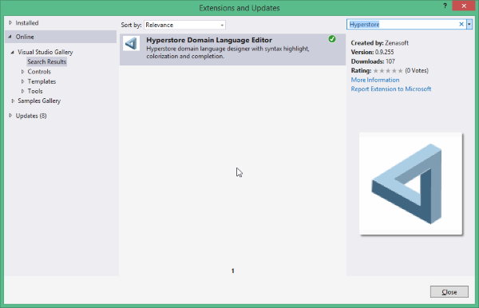
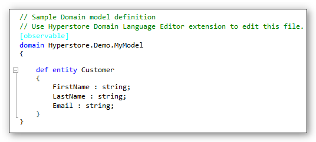
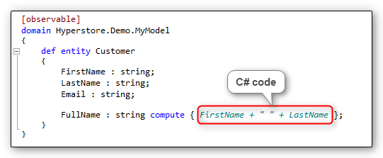
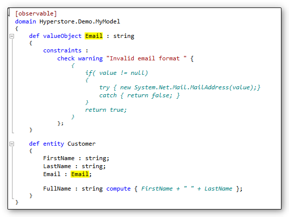

This topic shows you how use Hyperstore to create a simple observable model running in a **MVVM** context using the following **Hyperstore** features:

1. Data binding
2. Calculated property
3. Custom type with validation rule
4. Instanciation of a domain element in a session.

> Hyperstore is available as a Portable Class Library and can be used with the Microsoft Framework (from the 4.5.0 version), Windows Phone 8.0 and 8.1 and on IOS and Android thanks to Xamarin.

***

In this tutorial, you will create a simple customer with two simple properties, a calculated property and a property with a custom type containing its own validation rule.

This tutorial walks you through these basic steps :

1. [Create a WPF program](#Step1)
2. [Create a new domain describing a *Customer*](#Step2)
3. [Create a class to initialize the model](#Step3)
4. [Add a simple view to display the *Customer*](#Step4)
5. [Add a new Email custom type with its validation rule.](#Step5)

> Sources of this sample are available on [github](https://github.com/Hyperstore/Hyperstore.Samples/tree/master/Hyperstore.Samples.Overview).

## Create a WPF program
<a name="Step1"></a>Create a new WPF application and import the **Hyperstore Domain Language** Nuget package.


This package will load the Hyperstore core package and add a new domain definition file in the Model folder named *definition.domain*.

You can edit directly this file, but it's more practical to use the Hyperstore Visual Studio editor extension [Tools/Extensions and Updates...]



## Create a new domain
<a name="Step2"></a>We will use the sample domain definition file added by the nuget package to define the new domain.
This file is in the *Model*  folder.


This new domain contains just a simple *Customer* definition.

* Edit the file and replace the current Library sample with the *Customer*  definition using the [Hyperstore Domain Language Syntax](/DomainLanguage/Syntax). The definition looks like the following code :



This code defines a new Entity *Customer*  with three simple string properties.

* Add an **observable** attribute before the **domain** definition. By adding this attribute, your domain becomes *data binding ready*. Every changes on this domain (add, delete, update) will raise a NotifyPropertyChanged.

> This feature works also for collection as you can see in the next sample.

* Next add a calculated property called FullName with the following code :


The definition of this property mixes Hyperstore Domain Language (aka **HDL**) with native C# code. This is a specificity of **HDL**, you can add some C# code directly in the language (delimited by '{ }').

Once the domain is (well) defined, the associated C# code is immediatly generated on background and the class is available for intellisense.

### Add a class to initialize the model

The next step is to create a domain instance inside Hyperstore to begin manipulate *Customer* entity.

* Create a class called *Model* and add the following code :

```csharp
public Customer Customer {get; private set;}

public async Task Initialize()
{
	var domain = StoreBuilder.Create<MyModelDefinition>("Test");

    using(var session = domain.Store.BeginSession())
    {
    	Customer = new Customer(domain);
        session.AcceptChanges();
    }
}
```

This code create a new domain called 'Test' using the *MyModel* schema definition. The *MyModelDefinition*  class has been generated from the domain definition file.
Then an instance of *Customer*  is created within the newly domain. 

> Every model modification must be made within a session. A session is like a transaction supporting isolation, coherence and atomicity in multi-threading context.

Now we will bind the *Customer* to a view to display its properties.

### Add a simple view to display the *Customer*

* In the *mainwindow.xaml*, file add the xaml to display the properties in a *Grid*, for simplicity, copy the whole code from the [sample](https://github.com/Hyperstore/Hyperstore.Samples/blob/master/Hyperstore.Samples.Overview/Hyperstore.Samples.Overview/MainWindow.xaml).

* Then in the code behind, add the code to initialize the data context.

```csharp
private async Task Initialize()
{
  var model = new Model();
  await model.Initialize();
  this.DataContext = model.Customer;
}
```

* And then add the code to call the *Initialize* method.

```csharp
public MainWindow()
{
	InitializeComponent();
    Initialize();
}
```

* Run the program and see how all changes in the firstName or lastName properties are repercuted on the FullName property.

> Hyperstore has automaticly detected the FullName property dependencies and raises a property changed event if any is modified.

### Add a Email custom type with its validation rule

Now, we will see how adding validation rule for specific type of the domain.

For the moment, the Email is just a simple *string*  and has not any validation rule. For an email, it will be nice to validate its format every time it will be updated.

For that, we will create an new *Email* type. In **DDD** (Domain Driven Design), we can declare it as a *value object*. *HDL* uses the same concept to declare a new simple type (which it's not an entity). A **valueObject** overrides a primitive type like *string*, *double*, *int*,... or an immutable class like *CultureInfo*.

* To declare this new type, add the code at the beginning of the domain definition and change the type of the Email property to *Email*.



The custom type is defined as a *string*  and contains a constraint to validate the email format.

> Note the use of the variable **value** in the C# code corresponding to the current value of the property.

Now, if you execute the program a warning will be displayed if your input is invalid.


