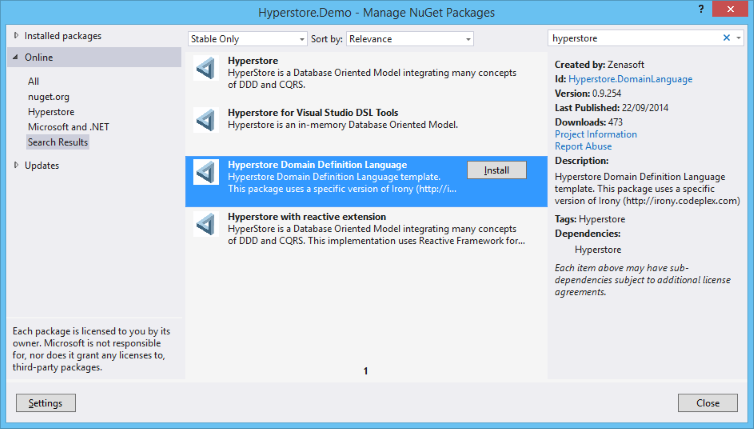
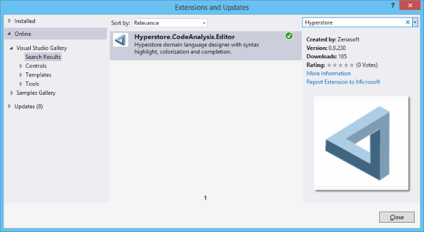

This topic shows you how use Hyperstore to create a simple observable model running in a **MVVM** context.

Hyperstore is available as a Portable Class Library and can be used with the Microsoft Framework (from the 4.5.0 version), Windows Phone 8.0 and 8.1 and on IOS and Android thanks to Xamarin.

In this tutorial, you will create a simple customer with two simple properties, a calculated property and a property with a custom type containg its own validation rule.

This tutorial walks you through these basic steps:
1. [Create a WPF program](#Step1)
2. Create a new domain describing a *Customer*
3. Create a class to encapsulate the model
4. Add a simple view to display the *Customer*
5. Add a new Email custom type with its validation rule.

> Sources of this sample are available on [github](https://github.com/Hyperstore/Hyperstore.Samples/tree/master/Hyperstore.Samples.Overview).

## Create a WPF program

Create a new WPF application and import the **Hyperstore Domain Language** Nuget package.

This package will load the Hyperstore core package and add a new domain definition file in the Model folder named *definition.domain*.

You can edit directly this file, but it's more practical to use the Hyperstore Visual Studio editor extension [Tools/Extensions and Updates...]

## Create a new domain

We will use the sample domain definition file added by the nuget package to define the new domain.

This file is in the *Model* folder.

This new domain contains just a simple *Customer* definition with, for the moment, two simple properties (FirstName and LastName).

Edit the file and replace the current Library sample with the *Customer* definition.

